# Avi_99L_MissionBoard
ロール角の制御を行う機体です。

## 搭載計器

### ミッション基板側
|名称|型番|用途|仕様書url|
|:---|:---:|:---:|:---|
|マイコン|ESP32 S3 WROOM-1 (N16R8 or N8)|制御用| https://documentation.espressif.com/esp32-s3_datasheet_en.pdf|
|6軸計|icm42688|加速度 角速度|https://d17t6iyxenbwp1.cloudfront.net/s3fs-public/2026-02/ds-000347_icm-42688-p-datasheet_0.pdf?VersionId=z2Bv_vW3nu7NZg3E3TYHbENt_fuKQupW|
|CANトランシーバ|MCP2562-E-SN|CAN通信|http://ww1.microchip.com/downloads/en/DeviceDoc/25167A.pdf|
|I2C/CAN物理層変換|LT3960JMSE#PBF|差圧計基板向け通信|https://www.analog.com/LT3960/datasheet|
|microSDスロット|DM3AT系|飛行ログ保存|https://www.hirose.com/product/en/download_file/key_name/DM3/category/Catalog/doc_file_id/49662/?file_category_id=4&item_id=195&is_series=1|
|USB-C|USB_C_Receptacle_USB2.0_16P|書き込み・デバッグ|https://www.usb.org/sites/default/files/documents/usb_type-c.zip|
|モータドライバ|TB67H450FNG x2|動翼・パラシュート機構の駆動|https://akizukidenshi.com/goodsaffix/TB67H450FNG_datasheet_ja_20190401.pdf|
|動翼モータ|A-max22 110158|動翼用モータ|https://www.maxongroup.co.jp/medias/sys_master/root/9399156342814/Cataloge-Page-EN-182.pdf|
|動翼エンコーダ|Encoder MR 201937|動翼用エンコーダ|https://www.maxongroup.com/medias/sys_master/root/8846495514654/EN-461-462.pdf|
|パラシュートモータ|Pololu 99:1 メタルギアモーター|パラシュート開放用モータ|https://jp.robotshop.com/products/pololu-991-metal-gearmotor-25dx54l-mm-hp-12v|
|電源MUX|TPS2121RUXR x3|電源入力切替| |
|理想ダイオード|LM66100DCK x2|電源ORing・逆流防止|https://www.ti.com/lit/ds/symlink/lm66100.pdf|
|電源保護IC|TCKE800NL,RF|電源ライン保護|http://toshiba.semicon-storage.com/|
|3.3Vレギュレータ|RT9080|ロジック電源生成| |
|5V電源モジュール|BP5293-50|5V系電源生成| |

### 差圧計基板側
|名称|型番|用途|仕様書url|
|:---|:---:|:---:|:---|
|差圧計|SSCDRRN005PD2A5|対気速度計測用|https://mm.digikey.com/Volume0/opasdata/d220001/medias/docus/2157/ssc_series_DS.pdf|
|気圧計|LPS25HB|気圧計測用|https://akizukidenshi.com/goodsaffix/lps25hb.pdf|
|I2C/CAN物理層変換|LT3960JMSE#PBF|ミッション基板向け通信|https://www.analog.com/LT3960/datasheet|

## 制御方式について

```mermaid
flowchart LR
    %% =========================
    %% Sensor inputs
    %% =========================
    ICM[ICM42688<br/>加速度・角速度取得]
    AIRBOARD[差圧計基板<br/>差圧・気圧取得]
    LT[LT3960系<br/>I2C/CAN物理層変換]
    ENC[エンコーダ A/B相]

    %% =========================
    %% Estimation / correction
    %% =========================
    IMU_CORR[IMU補正・推定装置<br/>平均化・フィルタ・角加速度推定<br/>（black box）]
    AIR_CORR[空力補正・推定装置<br/>平均化・フィルタ・対気速度推定<br/>（black box）]
    ENC_EST[エンコーダ計算装置<br/>A/B相デコード・角度微分<br/>（black box）]

    %% =========================
    %% Estimated outputs
    %% =========================
    OMEGA[補正後の機体ロール角速度]
    ALPHA[推定機体ロール角加速度]
    ACC[補正後の機体加速度]
    AIRSPEED[推定対気速度]
    FIN_ANGLE[現在の動翼角度]
    FIN_RATE[現在の動翼角速度]

    %% =========================
    %% Outer control
    %% =========================
    CTRL[ロール制御装置<br/>制御則・ゲイン切替・制限処理<br/>（black box）]
    TARGET[目標動翼角度]

    %% =========================
    %% Inner control
    %% =========================
    FIN_CTRL[動翼角度制御器<br/>目標角度・現在角度・角速度から<br/>PWM指令を計算]
    PWM_CMD[PWM指令生成<br/>Duty比・回転方向・Enable/Brake]

    %% =========================
    %% Actuator
    %% =========================
    MOTOR_CTRL[動翼駆動装置<br/>モータドライバ]
    MOTOR[動翼モータ]
    FIN[動翼]

    %% =========================
    %% Connections
    %% =========================
    ICM --> IMU_CORR
    IMU_CORR --> OMEGA
    IMU_CORR --> ALPHA
    IMU_CORR --> ACC

    AIRBOARD --> LT
    LT --> AIR_CORR
    AIR_CORR --> AIRSPEED

    ENC --> ENC_EST
    ENC_EST --> FIN_ANGLE
    ENC_EST --> FIN_RATE

    OMEGA --> CTRL
    ALPHA --> CTRL
    AIRSPEED --> CTRL
    FIN_ANGLE --> CTRL
    FIN_RATE --> CTRL

    CTRL --> TARGET

    TARGET --> FIN_CTRL
    FIN_ANGLE --> FIN_CTRL
    FIN_RATE --> FIN_CTRL

    FIN_CTRL --> PWM_CMD
    PWM_CMD --> MOTOR_CTRL
    MOTOR_CTRL --> MOTOR
    MOTOR --> FIN
    FIN --> ENC
```
